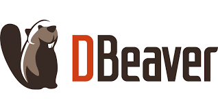

# 🔁ShareWE(쉘위)   

   
저희 ShareWE는 공유 경제 활성화를 지향합니다.   

닌텐도 스위치, 전동 킥보드, 심지어 자동차까지. 비싸게 주고 샀지만, 그만큼 사용하지 못해 아쉬운 물건들이 있습니다.

ShareWE에서는 이 물건들을 애물단지로 만들지 않습니다.

ShareWE는 이 물건들을 **안전하고, 편리하게** 다른 사람과 공유할 수 있습니다.

내 물건을 공유하고 싶은 사용자라면, 쉘위에 물품을 등록하시고 사용료를 받으실 수 있습니다.

물건을 쓰고 싶은 사용자라면, 쉘위에서 원하는 물품을 예약하시면 됩니다.

물건이 필요한 사람과 물건을 쓸 시간이 없는 여러분 모두에게 쉘위는 공유 경제의 가치를 드립니다!

Shall We Share?

 

## 1. 팀원소개: 사이좋은팀🥰 

  
|||||
|:-:|:-:|:-:|:-:|
|이경민 [@LKM1027](https://github.com/LKM1027)|이용우 [@L-dragon-woo](https://github.com/L-dragon-woo)|이인재 [@INJAELEE99](깃프로필URL)|이하경 [@fijitlwkr](https://github.com/fijitlwkr)|

 
 

## 2. 프로젝트 개요
### **서비스 소개**
ShareWE는 집에서 잘 사용하지 않는 고가의 물건들을 웹을 통해 사용자간 공유하는 서비스 입니다.   
사용자 간 그룹을 만들어서 원하는 사람들과 공유를 할 수도 있습니다.   
웹에서 물품 예약을 하면 정해진 시간에 지정 대여소에서 가져가서 사용할 수 있습니다.   
반납과 사용료 결제가 완료되면 물품 제공자는 사용료를 지불받을 수 있습니다.   

### **선정 이유**
공유 경제란 웹 기반 플랫폼을 통해 노동이나 제품과 같은 자원에 대한 액세스, 입력 또는 공유가 이루어지는 금융 모델을 말합니다.   
최근 공유경제 시장은 32.08%의 복합 연간 성장률(CAGR)을 유지하며 기하급수적으로 성장할 것으로 예상됩니다.   
또한 현재 소비자들의 가치관도 **소유**에서 **공유**로 전환하고 있습니다.   
현재 공유 경제 시장 분야는 교통, 숙박이 지배적입니다.   
때문에 저희는 이 분야들 뿐만아니라 고가의 물건들 역시 유휴 자원이라고 생각하고, 고가의 물건들을 사용자간 쉽게 공유하고자 하는 서비스가 필요하다는 점에서 이 프로젝트를 선정하였습니다.   

### **주요 기능**
- **물품 등록**
- **물품 예약**
- **그룹 내 물품 공유**
- **대여소 관리**
- **회원 시스템**
- **신고 및 관리 기능**
- **즐겨찾는 물품 조회 기능**

   
   

## 3. 유사한 서비스와의 비교

### 1. **쌩유**

- 서비스 특징
| 생활용품, 여행용품, 육아용품 등 다양한 물품을 공유할 수 있는 서비스.   
| 위치 기반 서비스로 주변에서 물품을 빌리며 전화번호를 등록하면 문의 시 대여자의 전화번호로 메시지 전송 및 연락.   
| 시즌에 맞는 물품들을 보다 손쉽게 확인함.

### 2. **꾸다**

- 서비스 특징
| 내가 살고 있는 동네에 있는 이웃과의 물건 공유가 가능함.   
| 사놓고 쓰지 않는 물건을 통해서 상호 간의 나눔이 가능함.   
| 후기 중 “렌탈 수수료가 있어서 돈이 더 들었다”는 언급이 있음.   
| 개인 간 대여 특성상 물건 상태 관리나 분실/손상 대응 체계가 미흡할 경우 사용자 불만 요인.

### 3. **OLIO**

- 서비스 특징
| 식품, 생활용품 등을 공유할 수 있는 서비스로 위치 기반 서비스로 주변에서 물품을 빌림.   
| 전화번호를 등록하면 문의 시 대여자의 전화번호로 메시지 전송 및 연락.
| 예약이 아닌 선점 시스템 선착순으로 물품을 공유하는 것이라 경쟁 및 사용 만족도 저하됨.   

### ShareWE 만의 차별점
- 원하는 **그룹 멤버** 끼리만 공유 가능
- **대여소**를 통해 물품을 주고받음

 
 

## 4. 개발 환경 및 기술 스택

### 개발 환경
- **DBMS**  

- **DB 관리 도구**  

- **가상화 환경**  

- **협업 도구**  

- **버전 및 이슈 관리**  

- **데이터 관리**  

- **ERD 및 다이어그램 도구**  

 
 

## 5. 프로젝트 기획
### 1. **WBS**

 

 WBS 이미지

 

### 2. **요구사항 명세서** 
[요구사항 명세서](./요구사항.pdf)
 

### 3. **UML**

 

 다이어그램 이미지

 

### 4. **DB 모델링**

 

 ERD 이미지

 

### 5. **테이블 정의서**
[테이블 정의서](./table.pdf)

 
 

## 6. 서버 구축
### 리플리케이션(Replication)

데이터를 여러 서버에 복제하여 저장하고, 이를 통해 데이터의 가용성과 성능을 높이고, 장애 발생 시 데이터 손실을 방지할 수 있습니다.  
 

**Master-Slave** Replication을 사용하였습니다

* **Master 서버**: 데이터를 업데이트하는 주체로, 데이터 변경이 일어나면 그 변경 사항이 슬레이브 서버로 복제됩니다.  
  

* **Slave 서버**: Master 서버의 데이터를 복제하여 읽기 작업만을 수행합니다.  
  

* **master-slave 호환 확인**  
  

* **slave에서 data 변경시 readonly 오류 발생**  
  

 
 

## 7. 테스트 케이스

### **7-1. 테스트 케이스 정의서**
테스트 케이스 정의서는 [여기](./요구사항.pdf)에서 확인하실 수 있습니다.
 

### **7-2. 더미데이터**
더미데이터 일괄 삽입 SQL문은 [여기](./database/DML.sql)에서 확인하실 수 있습니다.
 

### **7-3. 테스트 케이스 실행 예시**
testcase SQL문은 [여기](./testcase/)에서 확인하실 수 있습니다.

  
<strong>물품 등록</strong>

  [물품 등록 프로시저] 
  

  [before / after]
  

    
    
  

  
<strong>물품사진수정</strong>

  [물품사진수정 프로시저] 
  

  [before / after]
  

    
    
  

  
<strong>물품삭제</strong>

  [물품삭제 프로시저] 
  

  [before / after]
  

    
    
  

  
<strong>물품예약</strong>

  [물품예약 프로시저] 
  

  [before / after]
  

    
    
  

  
<strong>그룹생성</strong>

  [그룹생성 프로시저] 
  

  [before / after]
  

    
    
  

  
<strong>그룹참가</strong>

  [그룹참가 프로시저] 
  

  [before / after]
  

    
    
  

  [그룹 외 회원 참가 시도] 
  
  

  
<strong>물품즐겨찾기추가</strong>

  [물품즐겨찾기추가 프로시저] 
  

  [before / after]
  

    
    
  

  [중복 즐겨찾기 시도] 
  
  

  
<strong>물품평점조회</strong>

  [물품평점조회 프로시저] 
  

  [평점 조회 결과] 
  
  
  [평점 조회 불가 케이스] 
  

  
<strong>대여소수정</strong>

  [대여소수정 프로시저] 
  

  [사용가능여부 수정 before / after]
  

    
    
  

  
  [운영시간 수정 before / after]
  

    
    
  

  
<strong>블랙리스트추가</strong>

  [블랙리스트추가 프로시저] 
  

  [before / after]
  

    
    
  

